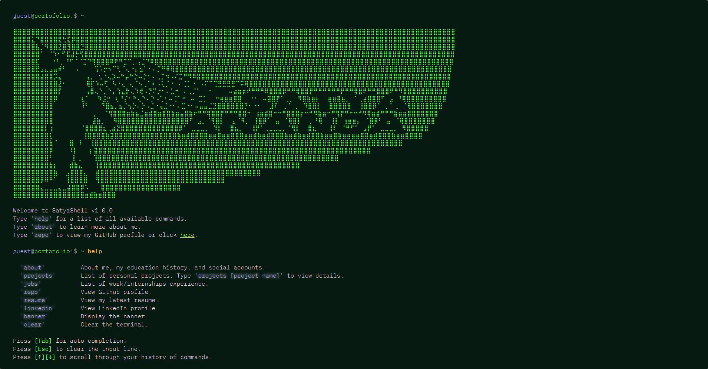

# [SatyaSh](https://satyaand.com/)

<div align="center">
  
</div>

Repository for my terminal-styled portofolio website. Credits to WebShellX for boilerplate.

## Features
* **[Tab]** for auto completion.
* **[Esc]** to clear the input line.
* **[↑][↓]** to scroll through your command history.
* Type **'help'** for list of available commands.

## Run the Project Locally:

Clone the repository
```shell
git clone https://github.com/satyaand/satyashell.git
```
Go to the project directory
```shell
cd satyashell
```
Install the dependencies
```shell
pnpm install
```
Start the server
```shell
pnpm run dev
```
